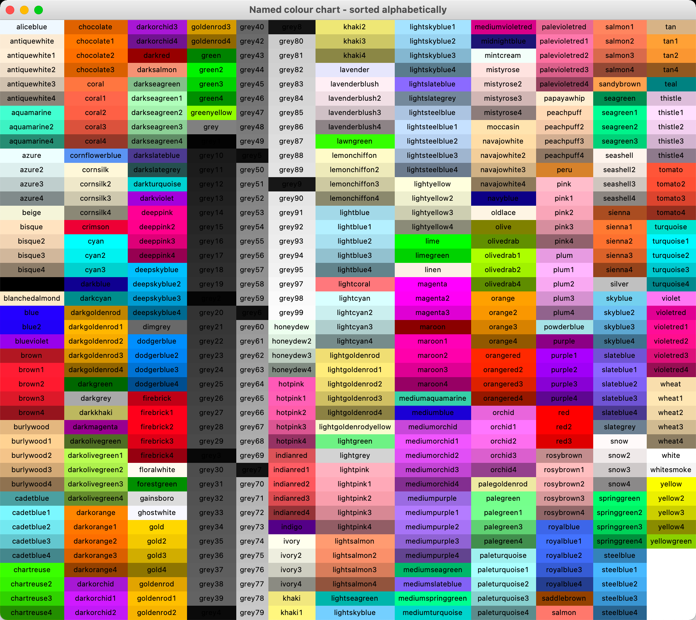
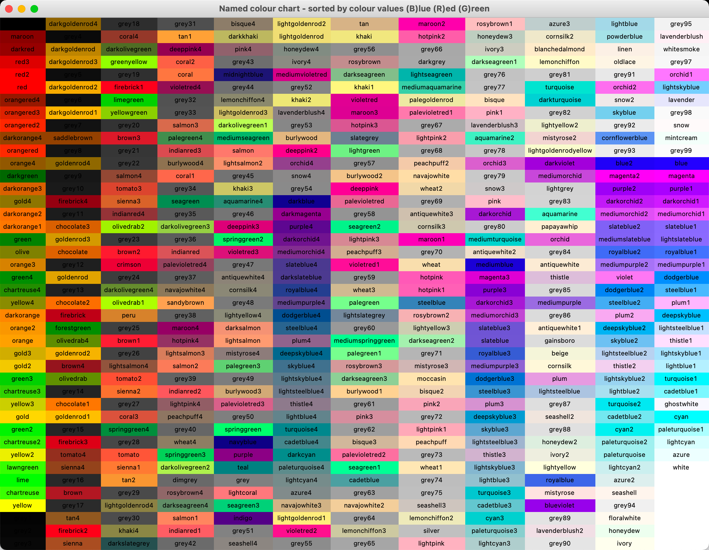
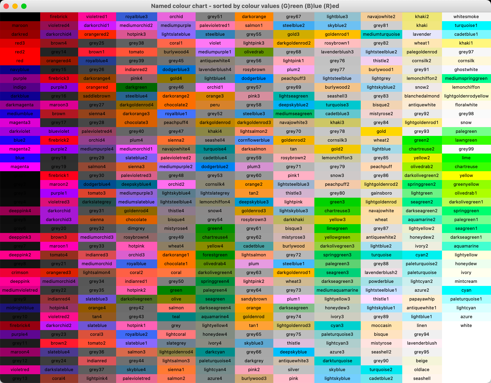
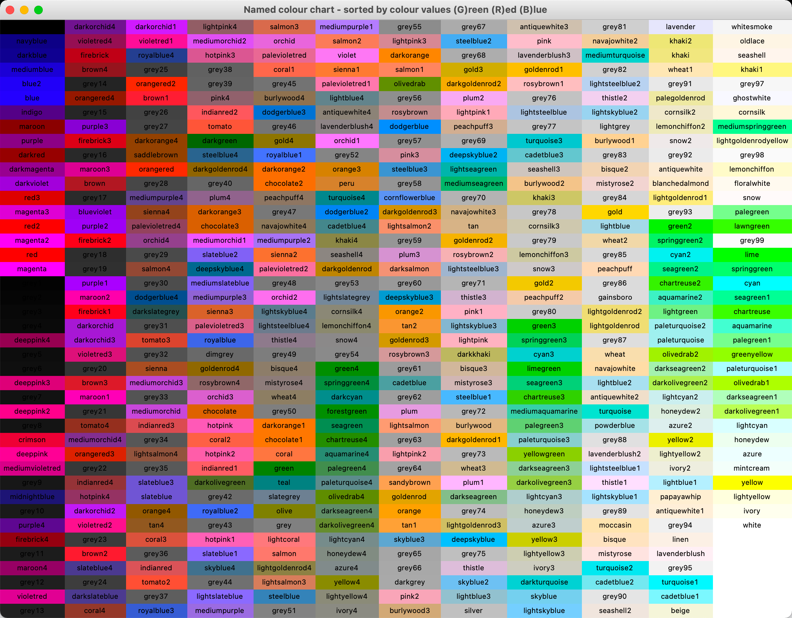
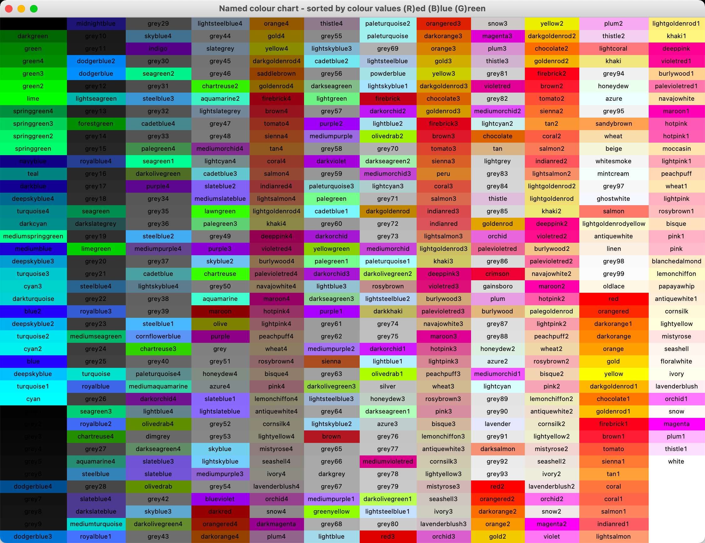
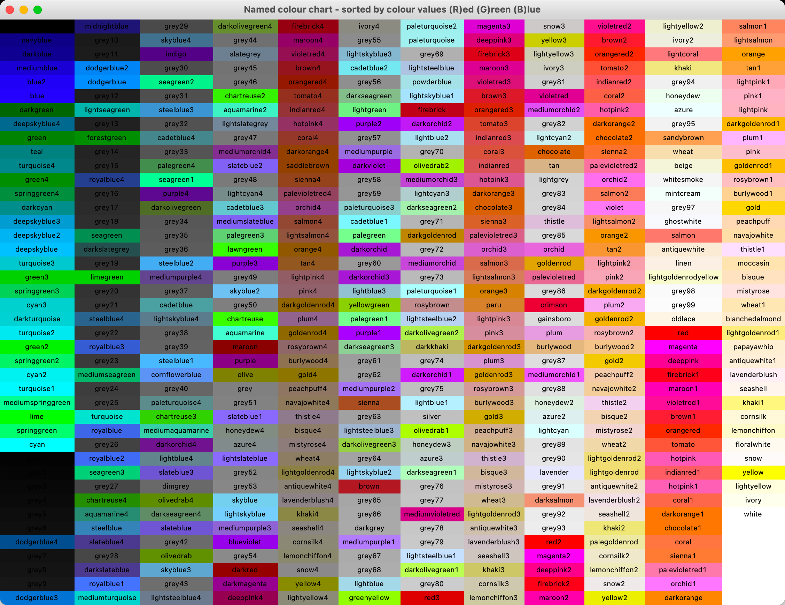

# tk colors

### Named colour chart - sorted alphabetically

### Named colour chart - sorted by colour values (B)lue (G)reen (R)ed

### Named colour chart - sorted by colour values (B)lue (R)ed (G)reen

### Named colour chart - sorted by colour values (G)reen (B)lue (R)ed

### Named colour chart - sorted by colour values (G)reen (R)ed (B)lue

### Named colour chart - sorted by colour values (R)ed (B)lue (G)reen

### Named colour chart - sorted by colour values (R)ed (G)reen (B)lue

